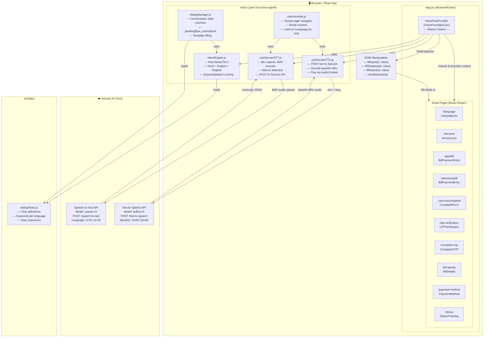
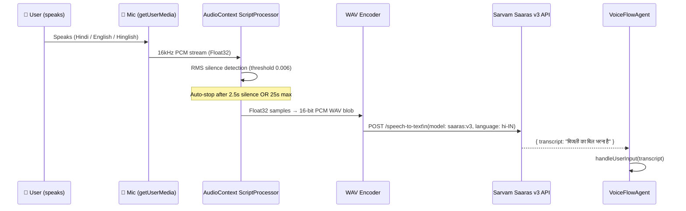
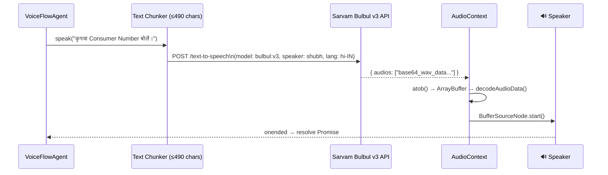
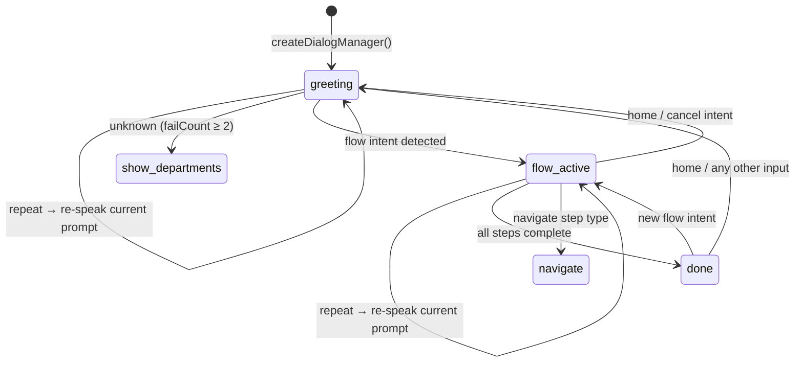
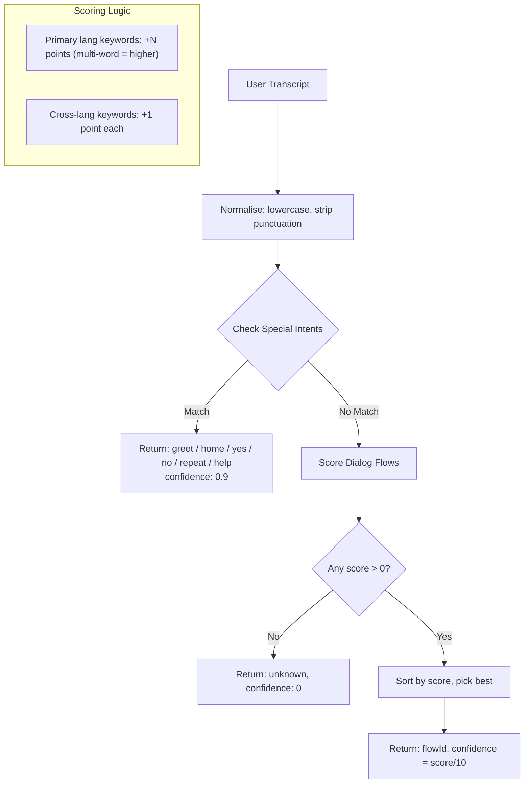
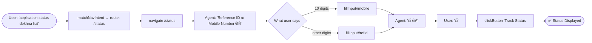

# eSaarthi Voice Agent — Architecture & Full Flow

## Overview

The eSaarthi voice agent is a **fully client-side, Hindi-first voice assistant** embedded in the KIOSK application. It enables citizens to navigate pages and fill forms entirely by speaking — with no cloud AI/LLM dependency. The pipeline is:

**Mic Audio → Sarvam STT → Rule-based NLU → Dialog State Machine → Sarvam TTS + DOM Action**

---

## System Architecture

---

## Component Breakdown

| File | Role |
|------|------|
| [VoiceFlowAgent.jsx](file:///c:/Users/taufi/Desktop/esaarthi-ai/src/voice-agent/VoiceFlowAgent.jsx) | Root provider. Orchestrates the entire voice loop — speak prompt → listen → process → DOM action → navigate |
| [useSarvamSTT.js](file:///c:/Users/taufi/Desktop/esaarthi-ai/src/voice-agent/hooks/useSarvamSTT.js) | Mic recording hook. Captures 16kHz mono PCM via `AudioContext ScriptProcessor`, encodes WAV, POSTs to Sarvam Saaras v3 |
| [useSarvamTTS.js](file:///c:/Users/taufi/Desktop/esaarthi-ai/src/voice-agent/hooks/useSarvamTTS.js) | Speech synthesis hook. POSTs text to Sarvam Bulbul v3, decodes base64 WAV, plays via `AudioContext` |
| [intentEngine.js](file:///c:/Users/taufi/Desktop/esaarthi-ai/src/voice-agent/intentEngine.js) | Rule-based NLU. Scores transcripts against keyword lists in Hindi + English + Hinglish. No external ML |
| [dialogManager.js](file:///c:/Users/taufi/Desktop/esaarthi-ai/src/voice-agent/dialogManager.js) | Conversation state machine. States: `greeting → flow_active → done`. Drives multi-turn dialogs |
| [useVoiceNav.js](file:///c:/Users/taufi/Desktop/esaarthi-ai/src/voice-agent/useVoiceNav.js) | Lightweight navigation-only hook for the Language/home page. Resolves routes from transcript keywords |
| `dialogFlows.js` (data) | Flow definitions — keywords, step sequences, prompts, and choices for each service flow |

---

## STT Pipeline (Mic → Text)

---

## TTS Pipeline (Text → Audio)

---

## Conversation State Machine (dialogManager.js)

> **States**: `greeting` (idle, waiting for intent) → `flow_active` (multi-step guided flow) → `done` (flow completed)

---

## NLU Intent Detection (intentEngine.js)

**Supported Special Intents:** `greet`, `home`, `yes`, [no](file:///c:/Users/taufi/Desktop/esaarthi-ai/src/voice-agent/intentEngine.js#8-16), `repeat`, `help`  
**Supported Dialog Flow Intents:** `gas_bill`, `gas_complaint`, `gas_new`, `elec_bill`, `elec_complaint`, `elec_new`, `status`, etc.

---

## Full End-to-End User Journey

### 🧾 Bill Payment Flow

---

### 📝 Complaint Registration Flow

---

### 📡 Status Tracking Flow

---

## Agent Status States

| Status | Meaning | Visual |
|--------|---------|--------|
| `idle` | Agent inactive | Mic button shown |
| `listening` | STT recording mic | Pulsing mic animation |
| `thinking` | Sarvam STT API call in progress | Processing indicator |
| `speaking` | Sarvam TTS playing audio | Speaker animation |

---

## Language Support

| Language | Coverage |
|----------|----------|
| Hindi (Devanagari) | Primary — all prompts spoken in Hindi |
| Hinglish (Roman Hindi) | Understood by NLU keyword matching |
| English | Understood by NLU, responses in Hindi |

The [normalise()](file:///c:/Users/taufi/Desktop/esaarthi-ai/src/voice-agent/intentEngine.js#8-16) function strips Hindi punctuation (`।`) and normalises whitespace before matching.

---

## Key Design Decisions

> [!NOTE]
> **No LLM / No Cloud AI for NLU** — All intent detection is pure keyword matching in [intentEngine.js](file:///c:/Users/taufi/Desktop/esaarthi-ai/src/voice-agent/intentEngine.js). This means zero latency for NLU, full offline-capable logic, and no API costs for understanding.

> [!IMPORTANT]
> **Sarvam AI is the ONLY external dependency** — Used for STT (`saaras:v3`) and TTS (`bulbul:v3`). API key is stored in [.env](file:///c:/Users/taufi/Desktop/esaarthi-ai/.env) as `VITE_SARVAM_API_KEY`.

> [!TIP]
> **DOM injection pattern** — Rather than lifting all form state to a global store, `VoiceFlowAgent` uses [fillInput()](file:///c:/Users/taufi/Desktop/esaarthi-ai/src/voice-agent/VoiceFlowAgent.jsx#110-122), [fillTextarea()](file:///c:/Users/taufi/Desktop/esaarthi-ai/src/voice-agent/VoiceFlowAgent.jsx#135-146), [fillSelect()](file:///c:/Users/taufi/Desktop/esaarthi-ai/src/voice-agent/VoiceFlowAgent.jsx#147-157), and [clickButton()](file:///c:/Users/taufi/Desktop/esaarthi-ai/src/voice-agent/VoiceFlowAgent.jsx#123-134) to directly manipulate React-controlled DOM elements via native input event dispatching. This avoids coupling the voice agent to each page's state.

> [!NOTE]
> **Silence detection threshold** — Set to RMS `0.006` to ignore ambient fan/AC noise. Auto-stops after `2.5s` of silence or a hard cap of `25s`.
